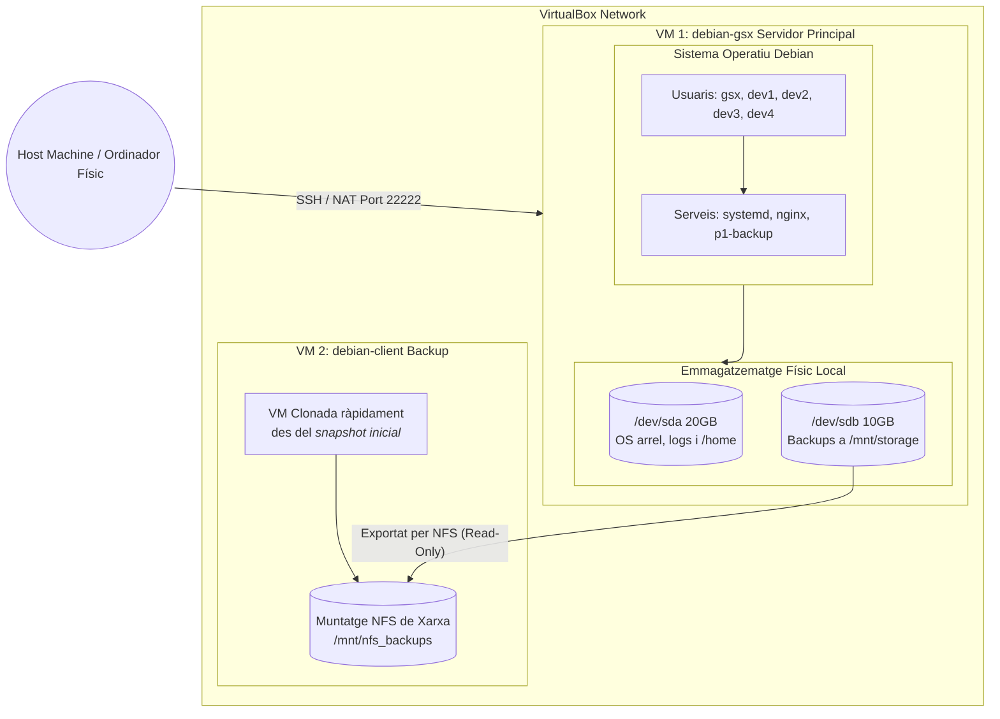
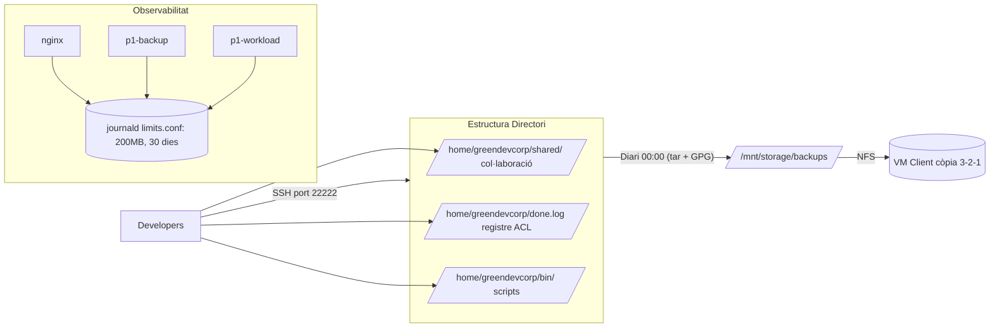

# Arquitectura del Sistema — GreenDevCorp

> Documentació tècnica de la infraestructura implementada al llarg de les 6 setmanes.

---

## Diagrama del sistema

*Accés remot a la VM principal: `ssh -p 22222 gsx@localhost` (des del host via NAT)*

---

## Flux de dades

---

## Decisions de disseny i trade-offs

### SSH per port 22222 i no 22
**Motiu**: Reduir el soroll de bots automàtics que fan scan del port 22. No és seguretat real, però redueix el volum de logs d'intents fallits.
**Trade-off**: Requereix recordar el port al connectar-se. En producció real, un firewall faria el mateix de forma més robusta.

### Autenticació per clau i no per contrasenya
**Motiu**: Les contrasenyes son vulnerables a atacs de força bruta i phishing. Una clau RSA/ED25519 no pot ser robada sense accés físic al fitxer.
**Trade-off**: Requereix gestionar les claus dels usuaris. Si es perd la clau privada, cal accés físic o consola per recuperar l'accés.

### systemd en lloc de cron per als backups
**Motiu**: systemd timers tenen `Persistent=true` (s'executen si el sistema estava apagat a l'hora programada), logs integrats a journald, i l'estat és visible amb `systemctl list-timers`.
**Trade-off**: Cron és més simple i universal. systemd és Debian/systemd-specific.

### Backup complet (full) en lloc d'incremental
**Motiu**: Per a la mida de dades d'un equip de 4-10 persones, el full backup és més simple de restaurar (un sol fitxer). Un incremental requereix la còpia base + tota la cadena d'incrementals.
**Trade-off**: Ocupa més espai. A partir de ~50 GB caldria reconsiderar rsync --link-dest (pseudo-incremental) o duplicati.

### Xifrat simètric (GPG AES-256) en lloc d'asimètric
**Motiu**: Més simple de gestionar per a un equip petit. Una sola passphrase per a tots els administradors.
**Trade-off**: Si la passphrase es filtra, tots els backups queden exposats. Amb xifrat asimètric caldria gestionar parells de claus però seria més segur.

### ACLs en lloc de múltiples grups
**Motiu**: `done.log` necessita que dev1 escrigui i tots llegeixin. Amb Unix permissions pures caldria un grup separat per a dev1. Les ACLs permeten especificar usuaris individuals sense proliferació de grups.
**Trade-off**: Les ACLs no es veuen amb `ls -la` (calen `getfacl`). Pot confondre admins menys experimentats.

---

## Pla d'escalabilitat

### Situació actual: 4 developers

L'arquitectura actual suporta 4 developers còmodament en una sola VM amb 2 GB RAM.

### Creixement a 10-20 persons

| Canvi nécessari | Implementació |
|----------------|---------------|
| Més RAM/CPU | Ampliar la VM (VirtualBox → resize) o migrar a servidor físic |
| Separar serveis | Nginx en VM pròpia, backup en VM pròpia |
| Autenticació centralitzada | LDAP o Active Directory en lloc de comptes locals |
| Monitoratge actiu | Prometheus + Grafana per a mètriques en temps real |
| Alertes | Alertmanager o PagerDuty per a notificacions quan un servei falla |

### Creixement a 100 persones

| Canvi nécessari | Implementació |
|----------------|---------------|
| Infraestructura com a codi real | Ansible o Terraform per a aprovisionament automàtic |
| Gestió de secrets | HashiCorp Vault en lloc de fitxers manuals |
| CI/CD | Jenkins o GitHub Actions per a desplegaments automàtics |
| Alta disponibilitat | Nginx en cluster (HAProxy), backups replicats a múltiples zones |
| Gestió d'identitats | SSO (Keycloak) + MFA per a tots els usuaris |
| Storage distribuït | NFS → Ceph o GlusterFS |

